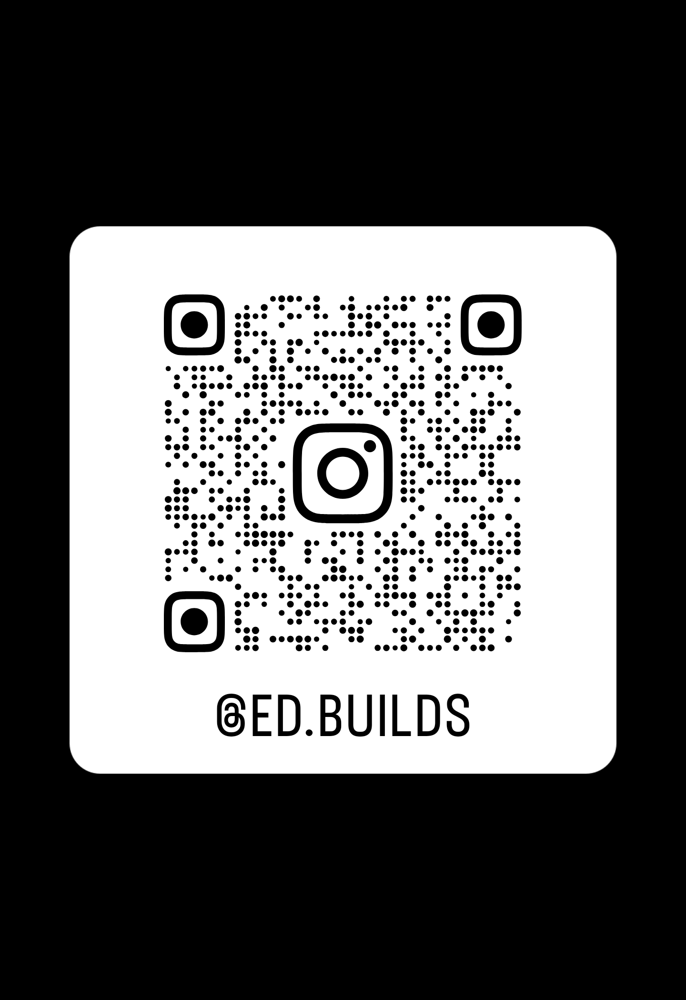

# Startup Kit

Repository for BLOQUE workshop materials, presentation assets, and future startup-focused content.

This repository starts with the first workshop in the series:

- `workshop/`: delivered workshop materials and presentation assets

## Current Structure

- `workshop/README.es.md`: main Spanish workshop guide
- `workshop/deck.es.html`: presentation deck
- `workshop/deck.es.css`: presentation styles
- `workshop/slides.es.md`: slide content and facilitator notes
- `workshop/slides-visual-notes.es.md`: visual slide script
- `workshop/design-brief.es.md`: visual direction for the deck
- `workshop/inputs_for_demo.es.md`: full live demo inputs
- `workshop/inputs_for_demo_quick.es.md`: shortened live demo inputs
- `workshop/prompt-pack.es.md`: Spanish prompt workflow
- `workshop/support/en/`: English support documents

## Contact

Ed Mosqueda  
Co-Founder of Codetitlan and 3erEspacio  
AI expert with 20+ years in software, product, and applied AI

- Contact link: https://tinyurl.com/46jxyde5

Instagram QR  

## Notes

This repository is being formalized incrementally as the BLOQUE content series grows with additional workshops, activities, and presentations.
